# React Native eCommerce App for Magento GraphQL api


[](https://github.com/sanjeevyadavit/magento_react_native_graphql/issues)


E-Commerce App written in React Native which consumes [Magento 2 GraphQL api](https://devdocs.magento.com/guides/v2.4/graphql/) to display catalog, products, add products to cart

## :camera: Screenshots

<div style="display:flex;" >
  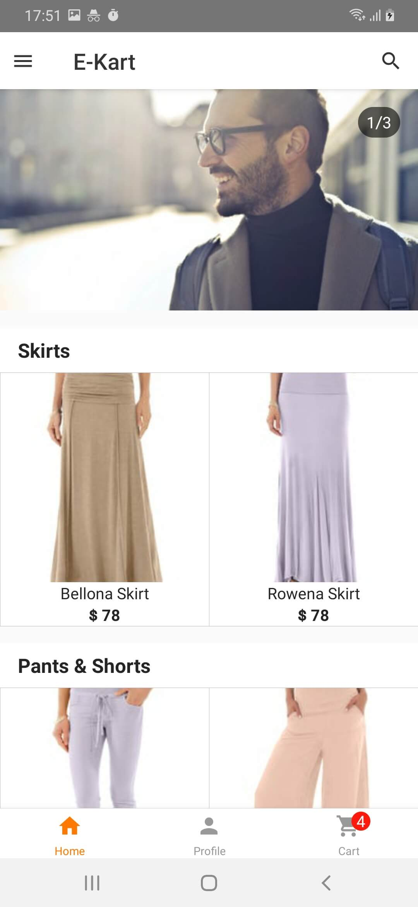
  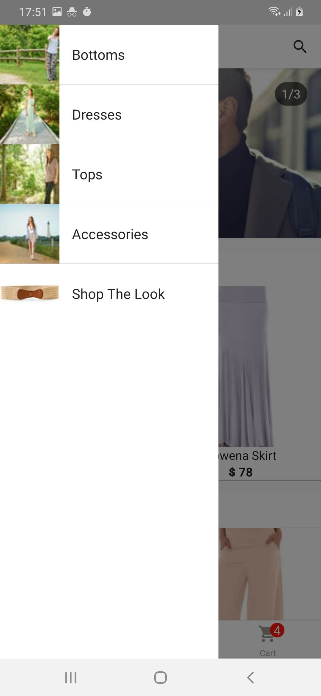
  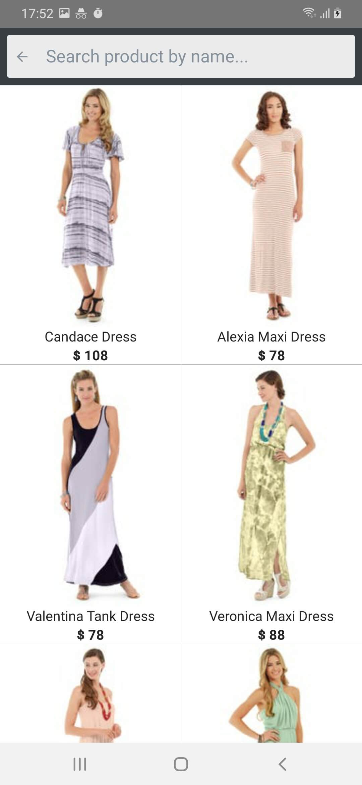
  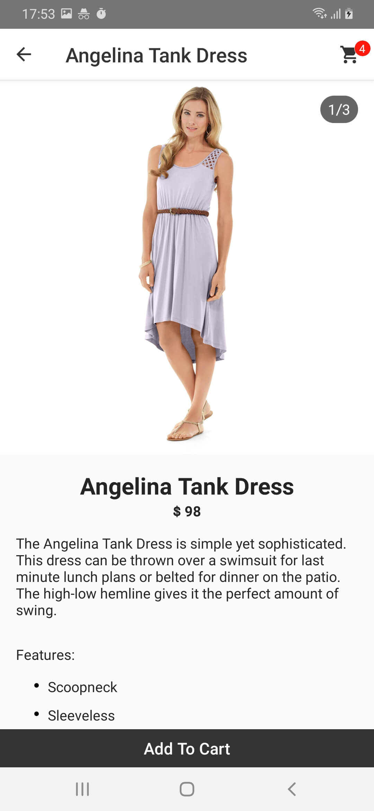
  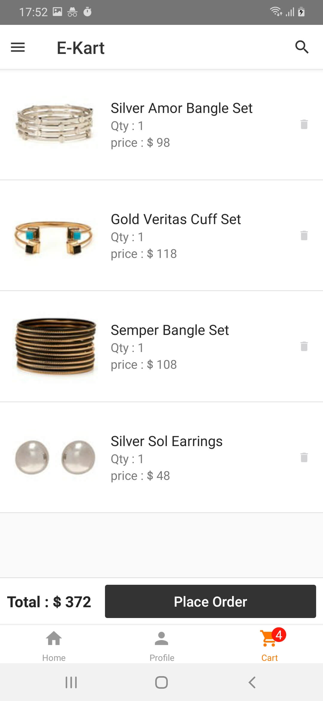
</div>

<div style="display:flex;" >
  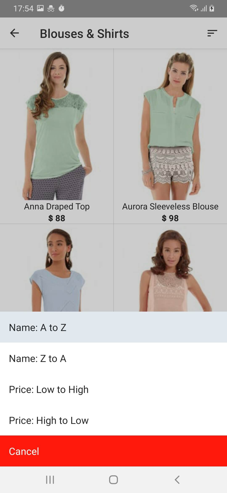
  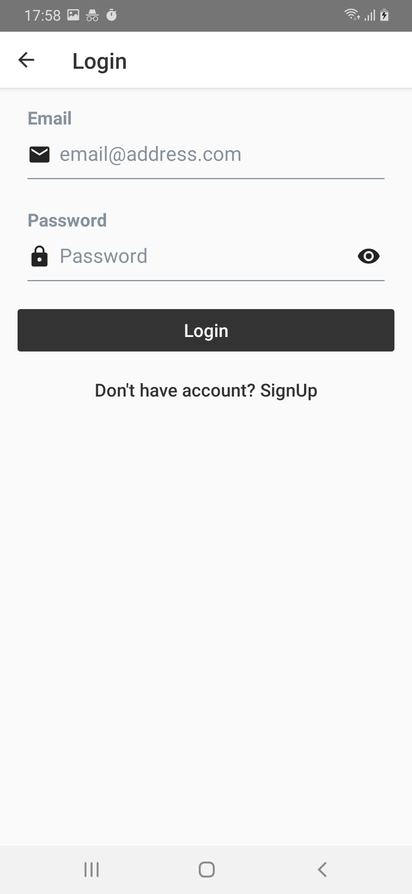
  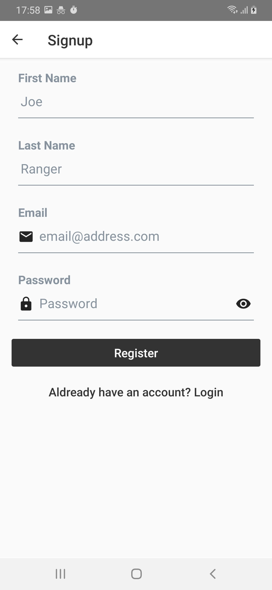
</div>

### (Dark mode)

<div style="display:flex;" >
  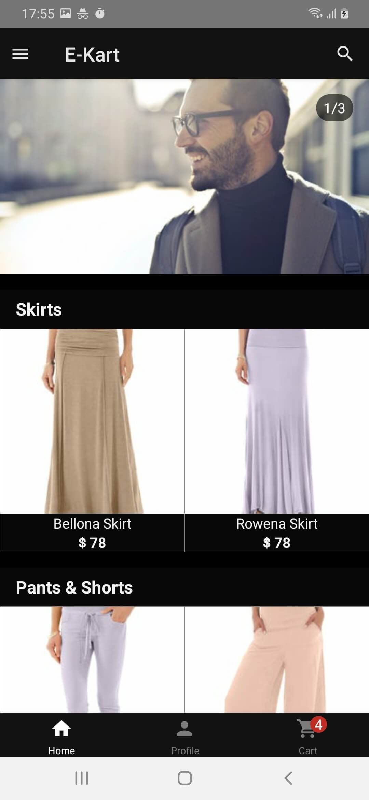
  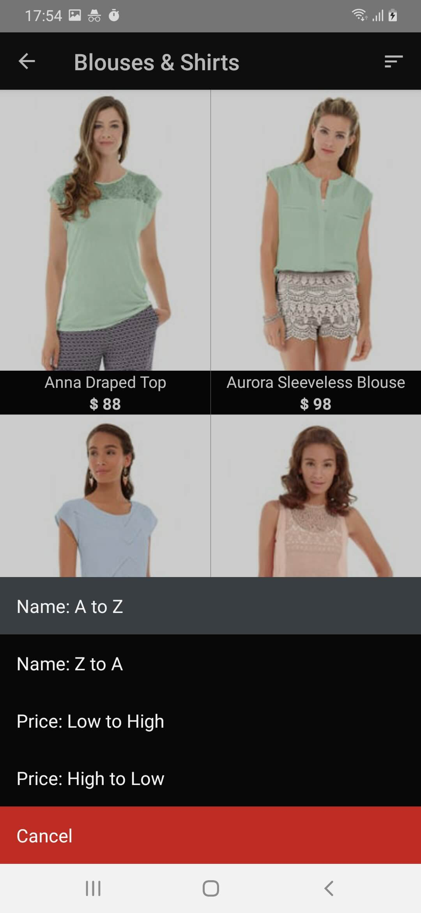
  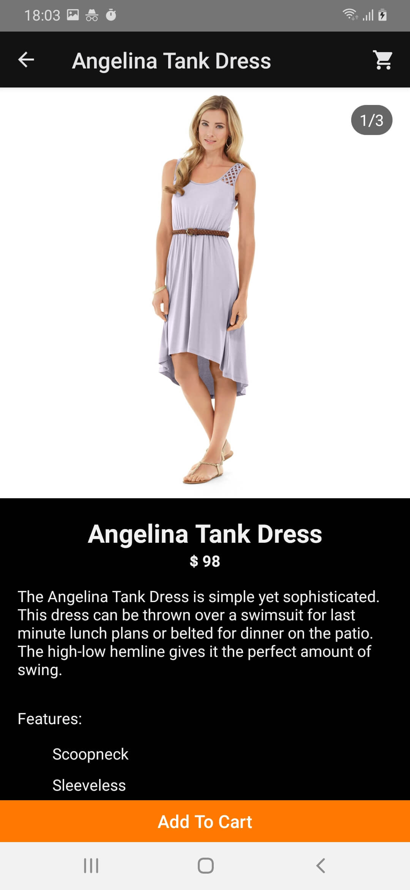
  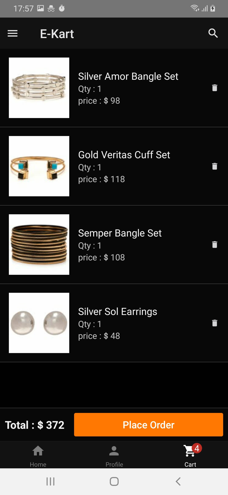
  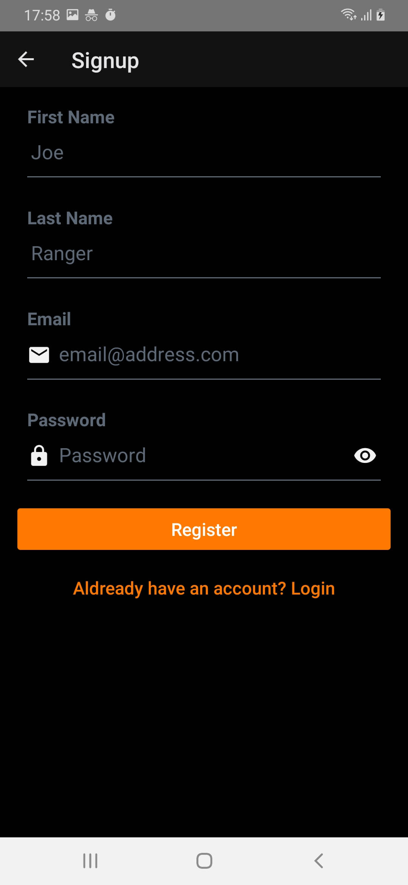
</div>

## 🚀 Getting Started:

1. Clone the repository, by tying this command in terminal

    ```sh
    git clone https://github.com/sanjeevyadavit/magento_react_native_graphql.git && cd magento_react_native_graphql

2. Install the dependencies 

    ```bash
    yarn install
    ```

### For Android

Run the following command while the emulator is open or a device is connected via adb.

``` 
yarn android
```

### For iOS

Run the following commands to install pods and run the app on iPhone simulator

``` 
cd ios && pod install && cd ..
yarn ios
```

## 🙋‍ Contribute [](http://makeapullrequest.com) 

If you find a bug, or if you have an idea for this app, please file an issue [here](https://github.com/sanjeevyadavit/magento_react_native_graphql/issues). We really appreciate feedback and inputs!

More information on contributing, head over to our [contribution guidelines](CONTRIBUTING.md). 

## 🗃️ Similar project

* [magento_react_native](https://github.com/sanjeevyadavit/magento_react_native) - (REST api)Complete eCommerce app written in React Native for magento 2 using best practices

* [magento-react-native-community](https://github.com/troublediehard/magento-react-native-community) - Original project on which this project is based

## ♥️ Donate

If this project help you, or to help acclerate development, you can give me a cup of coffee :smile: :

<a href="https://www.buymeacoffee.com/sanjeevyadavit" target="_blank"></a>

## 🛡 License

This project is licensed under the GNU v3 Public License License - see the [LICENSE.md](LICENSE.md) file for details.
